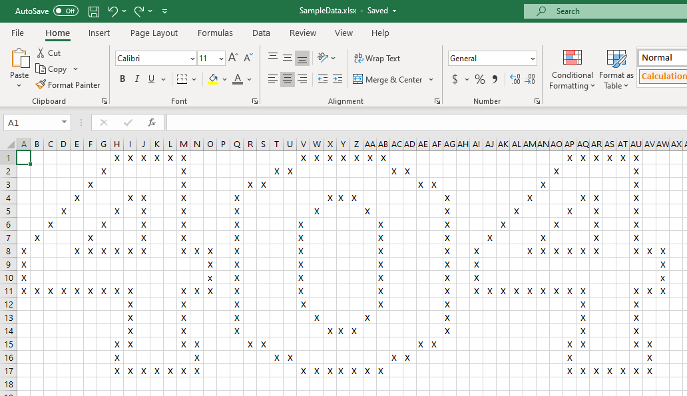

# game-of-life-ts


[](https://codecov.io/gh/philipf/game-of-life-ts)

Conway's Game of Life code kata in TypeScript 4

## Work in progress

View current progress here:

https://game-of-life-ts.notnot.ninja/


## Pre-requisites
- Node.js v12.8.3
- Optional, Visual Studio Extensions
  - Live Server
  - Mocha Test Explorer

## Development instructions
For WSL2, Update `settings.json` with:

```json
"liveServer.settings.useLocalIp": true,
```

More about the WSL2 and live server issue: https://github.com/ritwickdey/vscode-live-server/issues/760


Clone master
```bash
git clone https://github.com/philipf/game-of-life-ts.git
cd game-of-life-ts.git/
```

Prepare:
```bash
npm install
```

Test:
```bash
npm run test
```

Run and watch:
```bash
npm run build
```

## Change the initial game state

Update `values` in `src/index.ts`

````typescript
document.addEventListener("DOMContentLoaded", function(){
    const service = new GameService(50,100)

    const values = `
    ,,,,,,,X,X,X,X,X,X,,,,,,,,,X,X,X,X,X,X,X,,,,,,,,,,,,,,X,X,X,X,X,X,,,
    ,,,,,,X,,,,,,X,,,,,,,X,X,,,,,,,,X,X,,,,,,,,,,,X,,,,,,X,,,
    ,,,,,X,,,,,,,X,,,,,X,X,,,,,,,,,,,,X,X,,,,,,,,X,,,,,,,X,,,
    ,,,,X,,,,X,X,,,X,,,,X,,,,,,,X,X,X,,,,,,,X,,,,,,X,,,,X,X,,,X,,,
    ,,,X,,,,X,,X,,,X,,,,X,,,,,,X,,,,X,,,,,,X,,,,,X,,,,X,,X,,,X,,,
    ,,X,,,,X,,,X,,,X,,,,X,,,,,X,,,,,,X,,,,,X,,,,X,,,,X,,,X,,,X,,,
    ,X,,,,X,,,,X,,,X,,,,X,,,,,X,,,,,,X,,,,,X,,,X,,,,X,,,,X,,,X,,,
    X,,,,X,X,X,X,X,X,,,X,X,X,,X,,,,,X,,,,,,X,,,,,X,,X,,,,X,X,X,X,X,X,,,X,X,X,
    X,,,,,,,,,,,,,,X,,X,,,,,X,,,,,,X,,,,,X,,X,,,,,,,,,,,,,,X,
    X,,,,,,,,,,,,,,x,,X,,,,,X,,,,,,X,,,,,X,,X,,,,,,,,,,,,,,x,
    X,X,X,X,X,X,X,X,X,,,,X,X,X,,X,,,,,X,,,,,,X,,,,,X,,X,X,X,X,X,X,X,X,X,,,,X,X,X,
    ,,,,,,,,X,,,,X,,,,X,,,,,X,,,,,,X,,,,,X,,,,,,,,,,X,,,,X,,,
    ,,,,,,,,X,,,,X,,,,X,,,,,,X,,,,X,,,,,,X,,,,,,,,,,X,,,,X,,,
    ,,,,,,,,X,,,,X,,,,X,,,,,,,X,X,X,,,,,,,X,,,,,,,,,,X,,,,X,,,
    ,,,,,,,X,X,,,,X,X,,,,X,X,,,,,,,,,,,,X,X,,,,,,,,,,X,X,,,,X,X,,
    ,,,,,,,X,,,,,,X,,,,,,X,X,,,,,,,,X,X,,,,,,,,,,,,X,,,,,,X,,
    ,,,,,,,X,X,X,X,X,X,X,,,,,,,,X,X,X,X,X,X,X,,,,,,,,,,,,,,X,X,X,X,X,X,X,,
    
    `;
````

For convenience, new input can be generated based by updating the Excel document in `misc/SampleData.xlsx` and exported to CSV



## Deployment
Push to `master` for GitHub actions to build, test and deploy.
